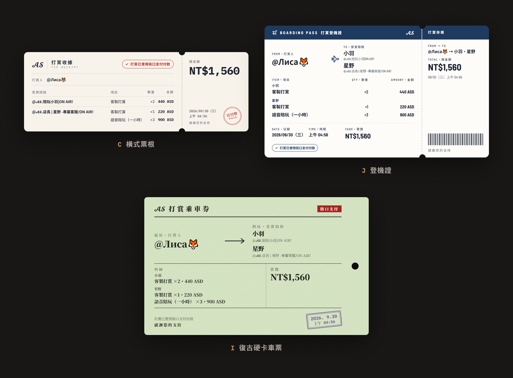
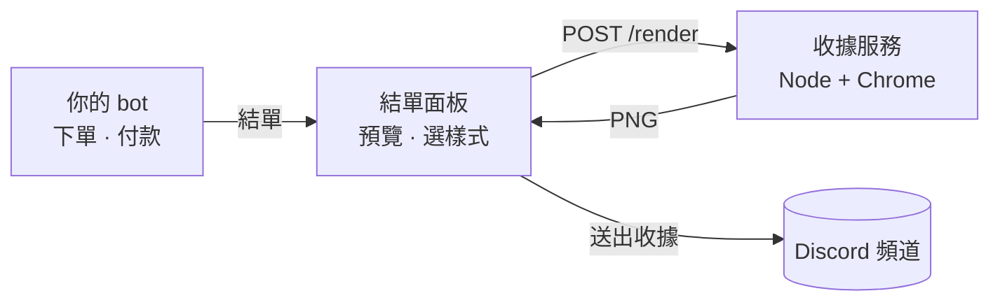
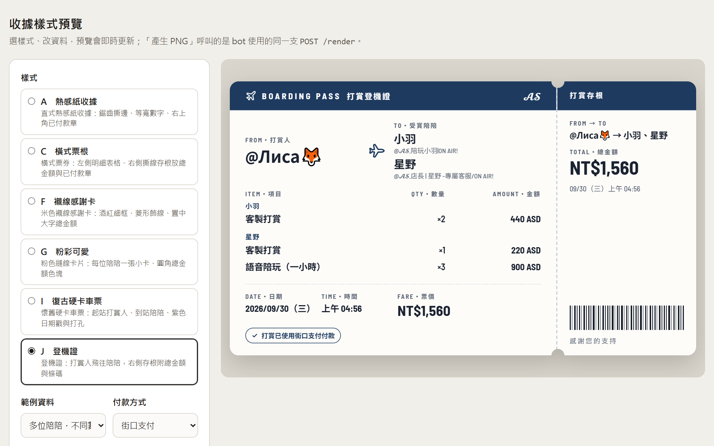

<div align="center">


<br>

<a href="#快速開始">快速開始</a>
&nbsp;·&nbsp;
<a href="#樣式">樣式</a>
&nbsp;·&nbsp;
<a href="#接入-discord-bot">接入 Discord bot</a>
&nbsp;·&nbsp;
<a href="docs/INTEGRATION.md">接入指南</a>
&nbsp;·&nbsp;
<a href="docs/REFERENCE.md">參考文件</a>

<br><br>


</div>

<br>

在 Discord 結單時，bot 會彈出一個只有下單者看得到的面板：先看收據預覽、用下拉選單挑樣式，按下「送出收據」後圖片才發到頻道。

出圖由獨立的 HTTP 服務負責，bot 用 Python、JavaScript 或其他語言寫都能接。

<table>
  <tr>
    <td width="33%" valign="top">
      <h4>結單面板</h4>
      預覽、切換樣式、送出或取消；只有結單的人能操作，逾時自動關閉。
    </td>
    <td width="33%" valign="top">
      <h4>六種樣式</h4>
      熱感紙、票根、感謝卡、粉彩、硬卡車票、登機證。每種樣式是一個資料夾，新增不必改程式。
    </td>
    <td width="33%" valign="top">
      <h4>八種付款方式</h4>
      儲值卡、錢包、街口、綠界、ATM、中信無卡、加密貨幣、美金轉帳，全寫在一個設定檔裡。
    </td>
  </tr>
  <tr>
    <td valign="top">
      <h4>多位陪陪</h4>
      同一種禮物給不同陪陪、數量不同，或一位陪陪收到多個禮物，都會自動依陪陪分組。
    </td>
    <td valign="top">
      <h4>不限語言</h4>
      附 discord.py 與 discord.js helper；其他語言直接呼叫 <code>POST /render</code> 取得 PNG。
    </td>
    <td valign="top">
      <h4>禁得起真實資料</h4>
      超長暱稱、千萬級金額、缺漏欄位都有處理；輸出 2 倍解析度、背景透明的 PNG。
    </td>
  </tr>
</table>

## 樣式




| 代號 | id | 名稱 | 特色 |
| :-: | --- | --- | --- |
| A | `thermal` | 熱感紙收據 | 鋸齒撕邊、等寬數字、右上角已付款章 |
| C | `ticket` | 橫式票根 | 左側明細表格，右側撕線存根放總金額 |
| F | `card` | 襯線感謝卡 | 米色卡片、酒紅細框、置中大字總金額 |
| G | `pastel` | 粉彩可愛 | 每位陪陪一張小卡、圓角總金額色塊 |
| I | `rail` | 復古硬卡車票 | 起站是打賞人、到站是陪陪，紫色日期戳與打孔 |
| J | `boarding` | 登機證 | 打賞人飛往陪陪，存根附總金額與條碼 |

呼叫時填 id 或代號都可以。想加新樣式，見[新增樣式](docs/REFERENCE.md#新增樣式)。

## 運作方式



收據服務用無頭 Chrome 把 HTML 樣式截成 PNG，並提供 `GET /templates` 讓 bot 產生下拉選單。下單、付款等流程仍由你的 bot 處理，這個專案只負責結單的最後一步。

## 快速開始

需要 Node.js 18.17 以上，以及 Chrome、Chromium 或 Edge。

```bash
npm install
npm start
```

打開 <http://127.0.0.1:3939> 就能使用樣式預覽頁：切換樣式、範例與付款方式，直接編輯資料，並用和 bot 相同的 API 產生 PNG。



## 接入 Discord bot

<table>
<tr>
<th width="50%">Python · discord.py</th>
<th width="50%">JavaScript · discord.js</th>
</tr>
<tr>
<td valign="top">

```python
receipts = DiscordReceipts(ReceiptClient())

view = await receipts.checkout(interaction, data)
await view.wait()

if view.status == "sent":
    save(view.template, view.sent_message)
```

</td>
<td valign="top">

```js
const receipts = new DiscordReceipts(new ReceiptClient());

const result = await receipts.checkout(interaction, data);

if (result.status === 'sent') {
  save(result.template, result.message);
}
```

</td>
</tr>
</table>

`data` 是一筆收據資料：

```json
{
  "payer": "@Лиса🦊",
  "items": [
    { "to": "@𝓐𝓢.店長 | 星野", "toShort": "星野", "name": "客製打賞", "qty": 1, "amount": 120 }
  ],
  "total": 120,
  "balance": 1470,
  "payment": "stored_value",
  "time": "2026-09-30T05:24:00+08:00"
}
```

逐步說明、訂單欄位對應、互動限制與疑難排解都在 **[接入指南](docs/INTEGRATION.md)**。可以直接執行的範例 bot 在 [`clients/python/example_bot.py`](clients/python/example_bot.py) 與 [`clients/js/example-bot.mjs`](clients/js/example-bot.mjs)。

## 文件

| 文件 | 內容 |
| --- | --- |
| [接入指南](docs/INTEGRATION.md) | 啟動服務、準備資料、Python / JS 接入、互動細節、疑難排解、上線檢查 |
| [參考文件](docs/REFERENCE.md) | 資料欄位、付款方式、HTTP API、錯誤碼、新增樣式、設定與部署 |

## 開發

```bash
npm test                                   # 單元測試，以及每個樣式的出圖測試
npm run samples                            # 每個樣式 × examples/*.json → out/
npm run render -- J examples/sample.json   # 輸出單張到 out/
npm run docs:images                        # 重新產生 README 圖片
```

<details>
<summary>專案結構</summary>

```
src/
  renderer.mjs     出圖核心：樣式清單、資料檢查、瀏覽器與並行控制
  server.mjs       HTTP 服務與預覽頁
  cli.mjs          指令列工具
templates/
  _shared/         共用執行環境（receipt-kit.js）與付款方式設定
  <id>/            各樣式：index.html + meta.json
clients/
  python/          ReceiptClient、discord.py helper（結單面板、樣式設定）、範例 bot
  js/              ReceiptClient、discord.js helper（結單面板、樣式設定）、範例 bot
docs/              接入指南、參考文件、README 圖片
examples/          範例資料
scripts/           批次出圖、產生 README 圖片
test/              node:test 測試
preview.html       樣式預覽頁
```

</details>
